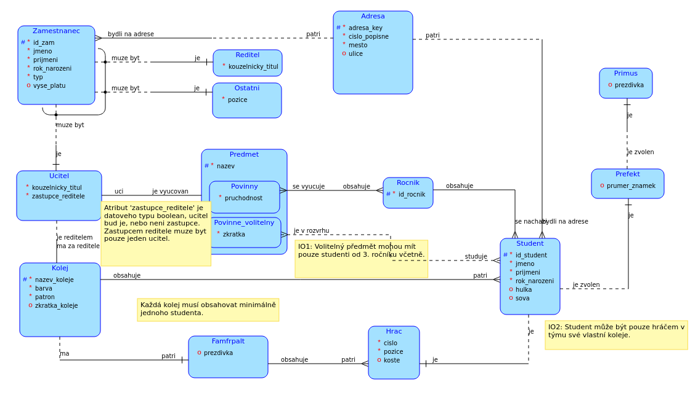
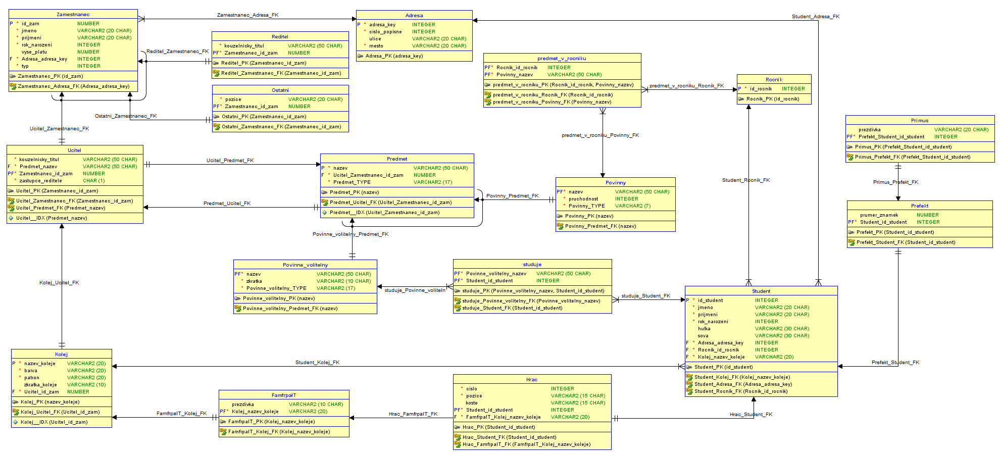

# Hogwarts
# ENG:

Databse about the structure of Hogwarts School of Witchcraft and Wizardry from Harry Potter books by J. K. Rowling. This database is my semestral work for the subject Database Systems at FIT CTU Prague 2018.

# CZ:

Databáze o struktuře Školy čar a kouzel v Bradavicích ze sérií knih Harryho Pottera od J. K. Rowlingové. Tato databáze je moje semestrální práce pro předmět Databázové Systémy (BI-DBS) na FIT ČVUT v Praze 2018.

# Konceptuální schéma:

# Relační schéma:

# License

The code is available under the [MIT](https://github.com/MartinTam/Hogwarts/blob/main/LICENSE) license.
